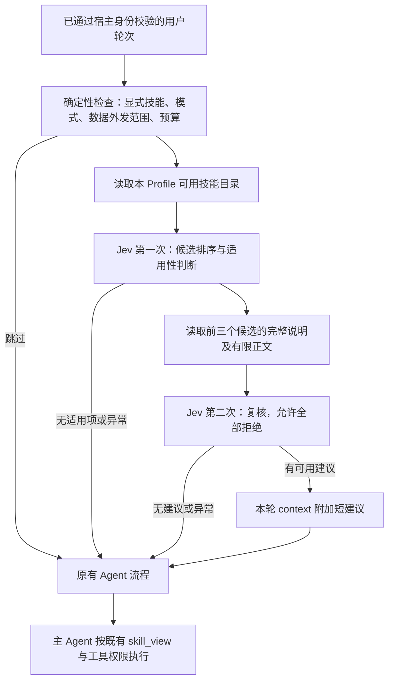

# Hermes 接入 Jev：技能推荐方案

日期：2026-09-24。状态：**设计提案，待实施**。本轮交付仅为方案文档；未安装依赖、调用 Jev、启用插件或修改运行配置。

## 1. 目标与第一版范围

在当前 Profile 可用的技能中，为一次用户请求推荐最合适的技能，减少名称相近导致的错选，以及没有适用技能时的多余加载。Jev 只返回建议；主 Agent 继续决定是否读取技能，工具权限及原有审批继续由宿主执行。

第一版返回零个或一个技能。复杂多意图请求由主 Agent 拆解，暂不让推荐器自动规划整条技能链。用户明确指定的技能优先走既有入口；不使用概率改写用户选择。

成功与否同时看推荐准确率、主 Agent 实际加载行为、任务完成质量和端到端成本。推荐器准确但主 Agent 未采纳，或增加时延而无质量收益，均不能算业务接入成功。

## 2. 本轮核对的事实与限制

| 对象 | 本轮证据 | 对设计的影响 |
| --- | --- | --- |
| canonical source | `/Users/lzc/Projects/agents/hermes-agent`，HEAD `159d93bdb`；已有规则和开发手册未提交变更 | 本文写在源码仓；实施须保留既有变更 |
| shared install | `/Users/lzc/.hermes/hermes-agent`，HEAD `8ff3a0c093` | 与 canonical 版本不同，不能用 canonical 测试代替运行版本兼容性验证 |
| 插件入口 | `hermes_cli/plugins.py` 注册 `pre_llm_call` 等生命周期 hook | 优先可选插件，避免把供应商逻辑放进 Agent 核心 |
| 本轮上下文 | canonical `agent/turn_context.py` 接收 hook 返回的 `context`；shared install 也有对应收集及临时注入路径 | 附加本轮建议，保持 system prompt、历史上下文和工具集合稳定 |
| 技能发现 | `tools/skills_tool.py` 有现有发现、禁用过滤和 `skill_view` 路径 | 复用实际 Profile 可用目录，不另建跨 Profile 全局索引 |
| 运行态 | 本轮未检查 Gateway PID、连接或实际模型请求 | 此文不证明插件已加载，也不刷新历史运行结论 |

实施前须在选定安装版本上验证 hook 参数、调用次数、上下文持久化行为及配置发现机制。发现兼容性缺口时停在离线评测，不借机升级全部 Profile。

## 3. 技术路线



默认采用 TypeSafe 官方 HTTP API 的薄适配器，不接第三方 MCP 转发层。先复用已存在的 HTTP 客户端；确需 SDK 时按仓库依赖规则锁定兼容范围和锁文件。Jev 调用不需要向主模型额外暴露工具 schema。

官方示例采用先排序、再阅读前三名细节的方式。本项目借鉴候选复核与拒选机制；具体阈值用本地中文样本确定，不复制示例常量。官方实验来自特定版本和样本，不构成本机收益证据。[官方技能示例](https://docs.typesafe.ai/cookbooks/skill_suggestion)

### 3.1 接入位置

建议新增可选 `jev-skill-router` 插件，源码目录建议为 `plugins/jev-skill-router/`，名称及配置项均为拟议接口。由插件注册 `pre_llm_call`，返回 `{"context": "…"}` 或 `None`。不在 `pre_gateway_dispatch` 中做网络判断：当前开发源码注明该 hook 发生在 auth/pairing 之前。

插件只处理已确认来自用户的交互轮次；Gateway 控制命令、审批回应、内部事件、恢复事件和 Cron 默认跳过。CLI 是否进入同一插件路径必须单独测试；第一阶段可只支持一个隔离 Gateway Profile。

每个 `(Profile, session_id, turn_id)` 最多执行一轮推荐流程。字段缺失或无法可靠判定用户轮次时跳过，不用文本猜造可信身份。去重状态使用有界会话缓存，并在结束或重置时清理；并发请求不能共享上一次建议。

### 3.2 输入最小化

首轮输入只包含获准外发的当前请求和技能目录的 `skill_id/name/description`；续接请求可加入同一会话的一小段经批准摘要。默认不发送完整历史、记忆正文、工具结果、路径、账号或配置。

候选必须与当前 Profile 实际可加载集合一致，包含禁用、平台及依赖条件检查。数据外发允许集是可加载集合的子集，私人技能正文未经明确允许不发给供应商。不能外发的候选仍保留在主 Agent 原有目录中。

候选目录不完整时，推荐器不能断言“没有适用技能”。返回 `unavailable` 并沿用原流程。Choice 当前最多 255 个选项，需为 `none` 预留一个名额；第一版超出供应商限制或本地 token 预算时跳过。后续分批检索需单独验证候选召回率。

第二轮只读取前三个候选的有限正文，优先包含触发条件、排除条件和输入输出约定。正文作为不可信数据；不能执行其中的指令。加载前再次检查候选仍可用，防止禁用或版本变更后的旧建议被应用。

### 3.3 问题设计

| 阶段 | 问题 | 原语 | 用途 |
| --- | --- | --- | --- |
| 粗排 | 当前请求最适合哪个已提供技能？ | Choice，含 `none` | 提取前三名；排名仅在本候选集内有意义 |
| 粗排 | 是否有技能与当前请求的实际目标匹配？ | Noul | 与“哪个最接近”分开判断 |
| 复核 | 阅读详细说明后，哪个候选适用？ | Choice，含 `none` | 降低同名、相邻功能的混淆 |
| 复核 | 候选 X 是否确实支持所要求的操作？ | 每候选一个 Noul | 所有候选均可不适用 |

同阶段问题合并为一次请求；第二阶段依赖第一阶段结果，不能假设两次可并行。只推荐同时满足验证集上确定的适用性、排序稳定性及置信度条件的候选。Choice 与 Noul 使用各自校准结果，不混用阈值；不把多项概率简单平均当作已校准概率。

### 3.4 内部返回契约

```json
{
  "schema_version": "jev-skill-advice-v1",
  "status": "suggested",
  "skill_id": "example-skill",
  "reason_code": "candidate_verified",
  "model": "jev-1.13.0",
  "question_version": "skill-routing-v1",
  "catalog_revision": "session-catalog-1",
  "elapsed_ms": 420
}
```

这是本地拟议包装格式，不是供应商原始响应，示例耗时不代表实测。`status` 为 `suggested | abstain | skipped | unavailable`；仅 `suggested` 可以带已验证的 `skill_id`。概率、confidence、usage 作为结构化评测字段保留，不让 Jev 生成解释文本。响应缺字段、问题不全、出现未知 ID 或非法数值时整体拒收。

向主 Agent 附加的内容由固定模板生成，例如“本轮可优先检查技能 example-skill；这是相关性建议，仍须核对用户意图与技能说明”。只插入白名单 ID，不拼接供应商自由文本或技能正文。建议不进入用户原文授权字段。

## 4. 配置、费用与故障处理

以下是拟议配置，不代表 Hermes 已支持这些键：

| 配置 | 初始建议 |
| --- | --- |
| `mode` | `off`；后续为 `shadow`、`recommend` |
| `model` | 固定通过评测的版本，初始候选 `jev-1.13.0` |
| `api_key_env` | 独立环境变量名 `TYPESAFE_API_KEY`，值在 Profile 凭据层 |
| `shortlist_size` | 3 |
| `total_deadline_ms` | 初始 2000，覆盖两次请求的总耗时，按实测调整 |
| `max_requests_per_turn` | 2；在线路径不做自动重试 |
| `max_input_tokens`、`daily_budget_usd` | 上线前按实际目录大小与使用频率填写，缺失则不启用 |
| `allowed_platforms` | 首期仅选定 Gateway 表面；Cron/内部事件默认排除 |

`shadow` 也会向外部 API 发送数据并产生费用，只是不把结果注入业务；同样需要外发范围和调用预算的明确授权。当前文档请求不包含此项授权。

超时、429/529、认证失败、非法响应、候选变更或总预算耗尽均回到原有技能流程。故障为 `unavailable`，不能记为“无技能适用”。429/529 在后续轮次采用有上限退避；预算耗尽后停止新调用。缺 key 且 `off` 时正常运行，显式启用却缺 key 时显示可诊断配置错误。

在发送前保守预估并预留并发预算，收到响应后按 usage 结算，防止多轮同时越过每日上限。按 Profile 统计，同时考虑账号共享限额。价格是变量：官方当前列出输入 $0.042/百万 tokens、输出免费；成本估算包含两次请求的 state 与问题，以及主模型因建议新增的上下文。不得只算 Jev 费用就宣称总成本下降。[模型规格](https://docs.typesafe.ai/models)

## 5. 数据、缓存和审计

- 使用 `get_hermes_home()` 定位当前 Profile；日志、评测输出及缓存按现有外盘规则落在源码外。实施时先核挂载，不临时选择内盘替代位置。
- 默认只记请求 ID、Profile 标识、模型/问题版本、候选 ID、结果码、耗时、usage 和回退原因；不记用户原文、技能正文或密钥。
- 首期不做跨轮结果缓存，避免过期建议和跨 Profile 泄漏。仅保留本轮去重与会话级目录快照；目录禁用变更必须即时参与最终检查。
- 本轮建议应通过 Hermes 临时上下文机制传入；测试必须证明不改写授权原文、不污染下一轮且不扩大工具权限。不同安装版本的持久化行为必须实际检查。
- API 的高置信度不等于正确率；供应商声明不使用请求训练，不等于普通账户自动具有零保留保障。启用前核实账户数据条款。

## 6. 评测与验收

先冻结中文为主的 300 条样本，按同一意图的改写分组拆成开发/阈值验证/最终测试三份（建议 120/60/120），避免近重复泄漏。样本包含相似技能、无需技能、目录不支持、显式技能、否定表达、多意图、续接、恶意正文及跨 Profile 候选。金标由独立人工审阅；合成样本单独统计，不替代自然请求。

比较 A 现有 Agent、B 单纯本地关键词/目录改进、C Jev 推荐三组；固定主模型、技能目录和题集。报告分母、失败及 skip，禁止仅统计成功 API 调用。最终测试只用于验收，失败后修改需新版本并保留原记录。

| 检查 | 拟议验收门槛，实施前冻结 |
| --- | --- |
| 越权或禁用技能推荐、跨 Profile 串建议 | 固定边界集观察到 0 次；零样本失败不证明绝对安全 |
| 错误加载与无必要加载 | 相对现有基线至少降低 20%，同时报告绝对数量；基线接近零时不以比例夸大 |
| 任务完成率 | 不出现关键场景退化；推荐层指标不能替代主 Agent 行为检查 |
| 时延 | 附加耗时 p95 初始目标不超过 1.5 秒，总截止时间 2 秒 |
| 费用 | 总成本/成功任务和每轮调用数可解释，处于批准预算内 |
| 故障 | 超时、限流、非法 ID、缺 key、重入均沿用原流程，无重复执行 |
| 会话缓存 | system prompt 与工具 schema 不因推荐改变；旧轮次无新增建议污染 |

小样本提升需同时报告不确定性；若无法确认收益，继续 shadow 或保持 off。新增离线测试通过 `scripts/run_tests.sh <新增测试文件>` 运行，隔离 `Path.home()` 与 `HERMES_HOME`。真实 API 评测为单独显式入口，不混入默认单元测试。

## 7. 实施顺序与交付

| 阶段 | 工作 | 完成证据 |
| --- | --- | --- |
| D0 | 审阅本方案，冻结输入范围、样本与验收门槛 | 设计与评测协议 |
| D1 | 开发薄适配器、问题定义、候选编译和假响应测试 | 真实函数离线测试，无外部调用 |
| D2 | 经授权运行脱敏样本评测，比较三组 | 固定版本、原始结构化计数、成本与错误分析 |
| D3 | 在隔离 Profile 验证当前 shared install 插件契约 | 实际 hook 和主模型输入证据，不以 mock 代替 |
| D4 | 选定一个 Profile shadow，再切 recommend | 经授权的部署及自然轮次观察 |
| D5 | 达标后按 Profile 逐个扩展 | 每个 Profile 独立回读和回滚说明 |

建议实现模块：插件入口、`client`、`questions`、`catalog`、`policy` 及对应测试，均先置于插件内；不提前建设跨项目公共服务。与超级助理共享概念和评测口径，第一版保持各自身份、输入与预算隔离。

回滚时将选定 Profile 模式改为 `off`，在其生命周期允许的安全时点重新加载配置并开启新会话；验证后续轮次零 Jev 请求、恢复原技能行为。需要卸载插件时仅撤销该 Profile 的启用项，保留可追溯评测记录。

## 8. 参考与待核实项

- [TypeSafe API](https://docs.typesafe.ai/api)：`POST /v1/systemone`、Choice/Noul/Score 与响应校验。
- [Confidence](https://docs.typesafe.ai/confidence)：概率分布与 confidence 不等价于实测正确率。
- [已知局限](https://docs.typesafe.ai/model-jaggedness/jev-1.13)：中文需实测；对抗输入、复杂推理及无关长上下文影响判断。
- [本地插件接口](../hermes_cli/plugins.py)、[本轮上下文实现](../agent/turn_context.py)、[技能工具](../tools/skills_tool.py)、[开发手册](agent-development-manual.md)。
- [超级助理的独立方案](../../super-assistant/docs/48_Jev项目与任务识别接入方案.md)。

本轮已核对公开文档与本地源码位置；未验证账户可用性、中文质量、网络时延、真实费用或插件线上行为。上述目标和配置均为提案，不是已达成结果。
